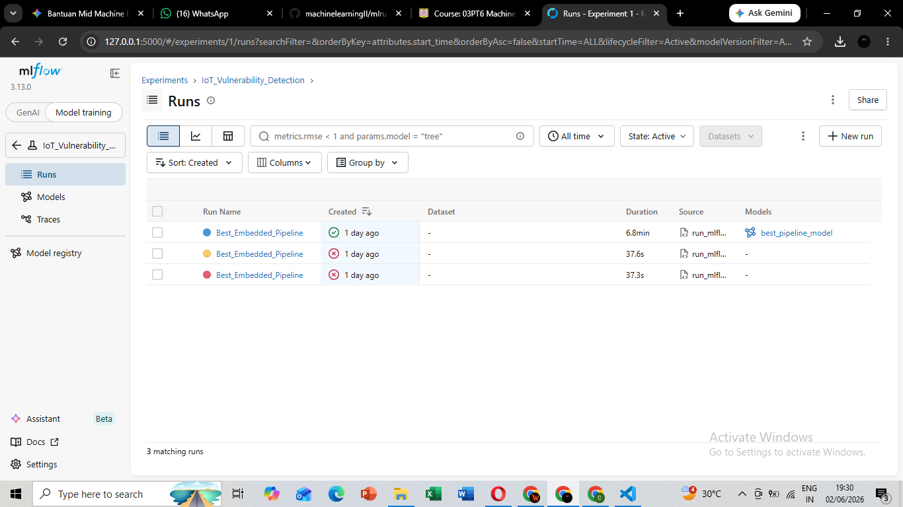
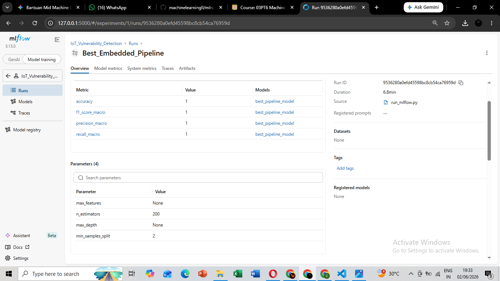
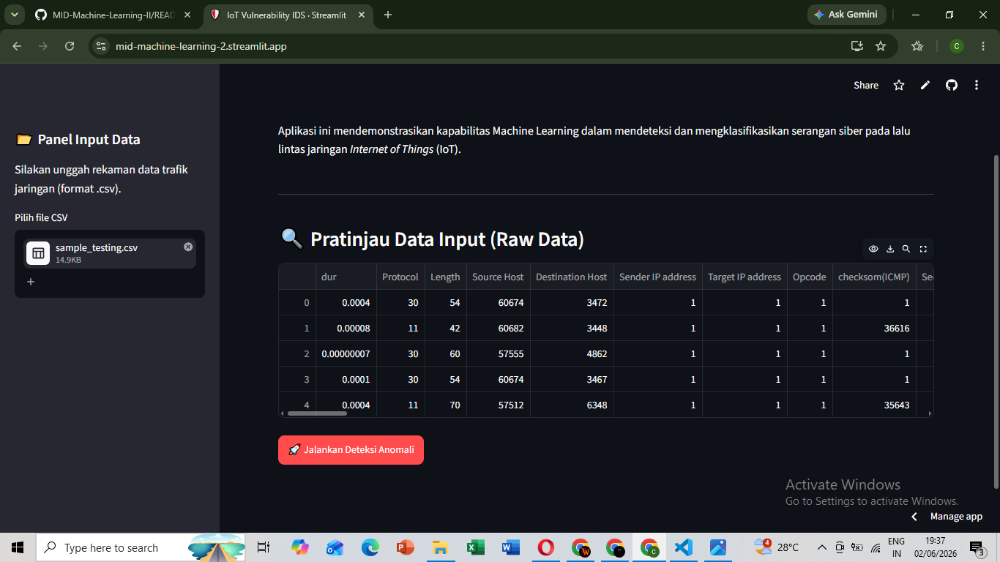
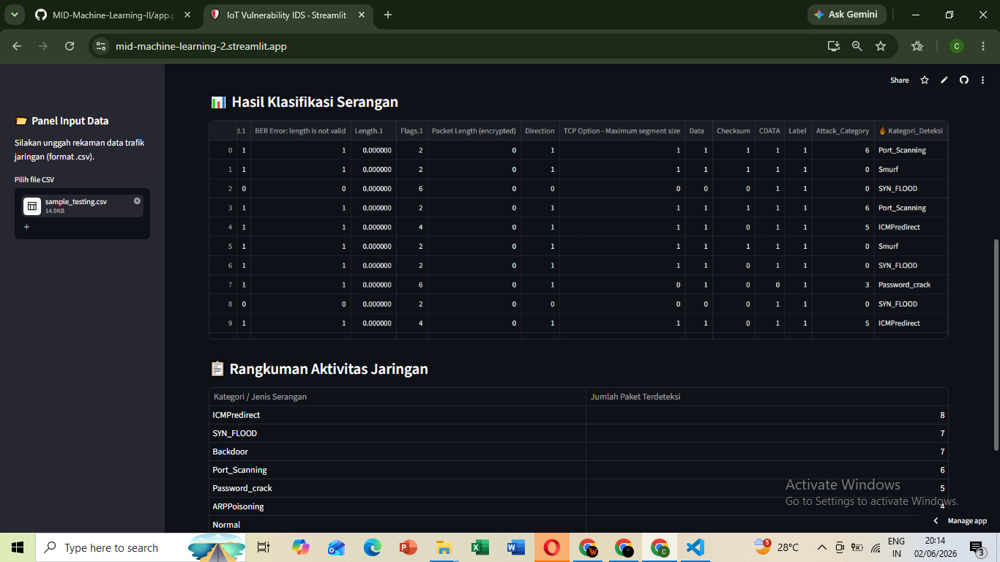

# 🛡️ IoT Vulnerability Intrusion Detection System (IDS)

Repositori ini berisi proyek Ujian Tengah Semester (UTS) mata kuliah Machine Learning II. Proyek ini berfokus pada pengembangan dan *deployment* model *Machine Learning* untuk mendeteksi serta mengklasifikasikan kerentanan (serangan siber) pada lalu lintas jaringan *Internet of Things* (IoT).

---

## 👥 Tim Pengembang
* **[Fajar Uli Andimas S.]** - [8020230156]
* **[Samuel Agung Kurniawan S.]** - [8020230261]
* **[Celvin Tan Cornelius]** - [8020230276]

---

## 📂 Struktur Repositori & File Wajib
Sesuai dengan instruksi penugasan, repositori ini memuat struktur file sebagai berikut:

* `eksplorasi_kelompok.ipynb` : *Notebook* utama yang berisi seluruh tahapan eksperimen, mulai dari *Exploratory Data Analysis* (EDA), seleksi fitur, hingga evaluasi model yang dilengkapi dengan narasi analisis.
* `run_mlflow.py` : *Script* Python terpisah yang digunakan untuk menjalankan *hyperparameter tuning* dan melacak eksperimen model final menggunakan MLflow.
* `app.py` : *Script* utama antarmuka web berbasis Streamlit untuk tahap *deployment*.
* `pipeline_terbaik.pkl` : Objek *Pipeline* utuh (berisi *Scaler*, *Feature Selection*, dan *Model*) yang telah dilatih dan disiapkan untuk mencegah terjadinya *Data Leakage*.
* `requirements.txt` : Daftar pustaka (*library*) dan dependensi yang dibutuhkan untuk menjalankan aplikasi di server Streamlit Cloud.

---

## 🚀 Fitur Utama Sistem
1. **Pencegahan Data Leakage:** Prapemrosesan data secara ketat dilakukan menggunakan `Pipeline` dari Scikit-Learn.
2. **Penanganan Imbalanced Data:** Menggunakan teknik sintesis data untuk menyeimbangkan kelas serangan yang langka pada data latih.
3. **MLflow Tracking:** Pencatatan parameter, metrik evaluasi (Akurasi, F1-Score, RMSE), dan penyimpanan artefak model secara terpusat.
4. **Streamlit UI:** Antarmuka interaktif yang dapat membaca file `.csv` baru dan langsung memetakan hasil prediksi ke dalam nama serangan yang spesifik (bukan sekadar angka kelas).

---

## 📸 Dokumentasi Eksperimen (MLflow)

### 1. Daftar Eksperimen & Run Terbaik

*Tangkapan layar di atas menunjukkan daftar run eksperimen pada MLflow, dengan run `Best_Embedded_Pipeline` mencatat performa paling optimal.*

### 2. Detail Parameter & Metrik

*Rincian parameter yang digunakan oleh model final beserta metrik evaluasinya.*

---

## 🌐 Dokumentasi Deployment (Streamlit)

Aplikasi web kami telah berhasil di-*deploy* dan dapat diakses secara publik.
👉 **[KLIK DI SINI UNTUK MEMBUKA APLIKASI STREAMLIT](https://mid-machine-learning-2.streamlit.app/)**

### 1. Panel Input & Data Mentah

*Tampilan antarmuka saat pengguna mengunggah file data testing (`sample_testing.csv`).*

### 2. Hasil Analisis Jaringan

*Tampilan hasil deteksi setelah data melewati objek Pipeline. Sistem berhasil memetakan hasil prediksi ke dalam kategori jenis serangan secara akurat.*

---

